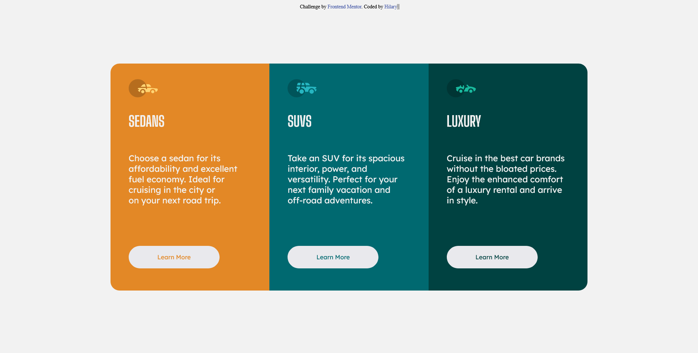

# Frontend Mentor - 3-column preview card component solution

This is a solution to the [3-column preview card component challenge on Frontend Mentor](https://www.frontendmentor.io/challenges/3column-preview-card-component-pH92eAR2-). Frontend Mentor challenges help you improve your coding skills by building realistic projects. 

## Table of contents

  - [The challenge](#the-challenge)
  - [Screenshot](#screenshot)
  - [Links](#links)
  - [Built with](#built-with)
  - [What I learned](#what-i-learned)
  - [Useful resources](#useful-resources)
- [Author](#author)

### The challenge

Users should be able to:

- View the optimal layout depending on their device's screen size
- See hover states for interactive elements

### Screenshot

Click the link above to see a screenshot of the project

### Links

- Solution URL: [Add solution URL here](https://github.com/dev-hills/3-column-preview-card)
- Live Site URL: [Add live site URL here](https://your-live-site-url.com)

### Built with

- Semantic HTML5 markup
- CSS custom properties
- Flexbox

### What I learned

I learnt how to use CSS flex

### Useful resources

- [Google Fonts](https://www.fonts.google.com) - This is where I got my Fonts from.
still learning this concept.

## Author

- Website - [Hilary](https://www.instagram.com/i_am_h.i.l.a.r.y)
- Github - [@dev-hills](https://github.com/dev-hills)
- Frontend Mentor - [@dev-hills](https://www.frontendmentor.io/profile/dev-hills)
- Twitter - [@greathills8](https://www.twitter.com/greathills8)

